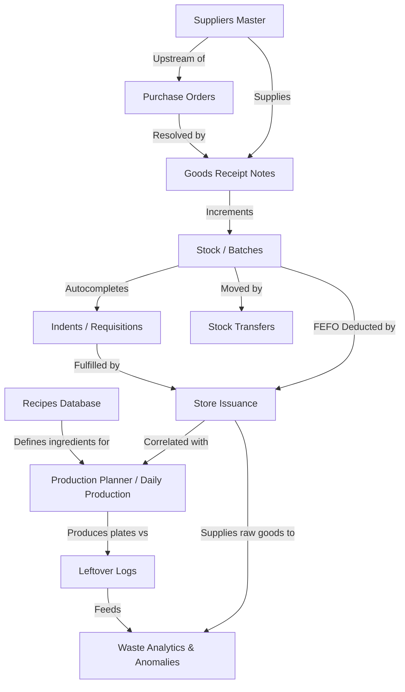

# Module Dependency Map & Gap Analysis

This document traces the data flow, coupling, and structural dependencies across the modules of the Kapila Hotel Inventory Management System, identifying functional and operational gaps.

---

## 1. Module Dependency Map

The diagram below illustrates the upstream and downstream data relationships between the core inventory modules:

### Module Dependency Breakdown

| Module | Upstream Dependencies (Inputs) | Downstream Dependencies (Outputs) | Coupling Level |
|---|---|---|---|
| **Suppliers** | None (Core Master Data) | Purchase Orders, GRNs | Low |
| **Purchase Orders (PO)** | Suppliers | Goods Receipt Notes (GRN) | Medium |
| **Goods Receipt Notes** | Purchase Orders, Suppliers | Stock / Inventory Ledger | High |
| **Stock / Batches** | Goods Receipt Notes, Stock Transfers | Indents, Issuances, Transfers | Critical |
| **Indents** | Stock Master (autocomplete) | Store Issuances | High |
| **Issuance** | Indents, Stock Master (FEFO) | Waste Analytics, Production (correlation) | Critical |
| **Recipes** | None (Core Master Data) | Production Planner | Medium |
| **Production** | Recipes, Issuance (correlation) | Leftovers, Waste Analytics | High |
| **Leftovers** | Production | Waste Analytics | Medium |
| **Transfers** | Stock Master | Stock Master | Medium |

---

## 2. Identified Integration & Workflow Gaps

Analyzing the dependency paths reveals the following gaps in the current implementation:

### Gap A: Loose Requisition-to-Procurement Coupling
* **Description:** Purchase Orders can be created out-of-band without being linked to or generated from approved department Indents.
* **Risk:** The purchasing department can buy goods that no department has requested, leading to overstocking.
* **Resolution:** Implement a "Procurement Requisition" flow where approved Indents that cannot be fulfilled by current stock automatically draft PO suggestions.

### Gap B: Missing Recipe-to-Production Integration
* **Description:** Daily Production logs plates prepared, and Issuance logs raw materials issued. However, there is no automatic mapping comparing actual raw material depletion against recipe ingredient benchmarks.
* **Risk:** Kitchen waste or theft of raw ingredients goes undetected because there is no automated "Yield Analysis" (e.g., *10 kg chicken issued should produce 50 plates, but only 30 logged*).
* **Resolution:** Connect the **Recipes** module with the **Production Planner** to auto-calculate expected raw material consumption and flags variances during issuance.

### Gap C: Blended Banquet / Event Stock
* **Description:** Materials drawn for large one-off banquets or events are issued using the standard department flow.
* **Risk:** Event consumption spikes pollute the 7-day rolling baseline of the **Anomaly Detector**, triggering false-positive alerts.
* **Resolution:** Ring-fence event-specific issuances with a distinct tag and exclude them from the rolling daily averages.

### Gap D: No Reversal / Return Flow
* **Description:** If a department head draws too much stock or the wrong item, the storekeeper cannot digitally "return" it to the stock.
* **Risk:** Stock ledger quantities deviate from physical counts.
* **Resolution:** Implement a `POST /api/returns` endpoint allowing departments to return unused goods, incrementing batch levels with a "Returned" transaction type.

### Gap E: Lack of Month-End Stock Freeze
* **Description:** Physical audits and cycle-counts can be logged while normal stock receipts and issuances are concurrently executing.
* **Risk:** Race conditions lead to auditing incorrect variances.
* **Resolution:** Add a system-wide flag to lock stock modifications (`is_frozen`) for specific departments during audit cycles.
