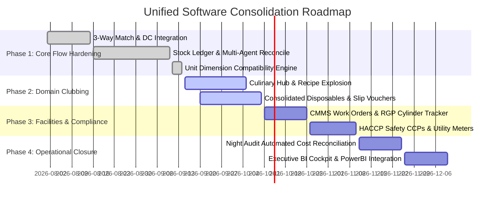

# Hotel Kapila ERP — Master Software Unification & Consolidation Plan ("The Clubbed Architecture")

**Document Version:** 1.0.0 Enterprise Unified Release  
**Status:** Living Master Specification & Operational Blueprint  
**Target Architecture:** Fully Unified Hotel Operations & Inventory ERP Suite  
**Applicability:** All Modules, Screens, Back-End Services, Multi-Agent Engines & Database Schemas  

---

## 1. Executive Vision: "Clubbing" the Entire Software

Hotel Kapila operates a complex hospitality environment encompassing morning raw material intake, multi-department culinary preparation (9 distinct kitchen departments), centralized storekeeping, asset maintenance, gate security, food safety compliance, and night audit financial closures.

Over development cycles, numerous specialized subsystems and multi-agent micro-engines were built (Stock, Inbound DC, PO/GRN, Indent TrendScout, Recipe Scaler, Store Issuance, Reconciliation, CMMS, Gate RGP, HACCP Food Safety, Staff Attendance, and BI Analytics).

**The "Clubbed Architecture" unites every isolated screen, service, agent, and database entity into one cohesive, single-pane-of-glass Enterprise Resource Planning (ERP) platform.**

```
                                  HOTEL KAPILA UNIFIED ENTERPRISE CORE
                                                  │
          ┌────────────────────────┬──────────────┴───────────────┬────────────────────────┐
          ▼                        ▼                              ▼                        ▼
 ┌──────────────────┐    ┌──────────────────┐           ┌──────────────────┐     ┌──────────────────┐
 │ 1. INBOUND &     │    │ 2. CULINARY &    │           │ 3. WAREHOUSE &   │     │ 4. GOVERNANCE,   │
 │ PROCUREMENT      │    │ PRODUCTION       │           │ STORE FULFILLMENT│     │ SAFETY & AUDIT   │
 ├──────────────────┤    ├──────────────────┤           ├──────────────────┤     ├──────────────────┤
 │ • Vendor Master  │    │ • 17-Cat Recipes │           │ • Double-Entry   │     │ • Multi-Agent    │
 │ • PO & Reorder   │    │ • Portion Scaler │           │   Stock Ledger   │     │   Reconciliation │
 │ • Morning DC     │    │ • TrendScout Mon │           │ • FIFO Batches   │     │ • CMMS Asset Maint│
 │   Provisional    │    │ • Unified Indent │           │ • Unit Dimension │     │ • Gate RGP & Util│
 │ • 3-Way Match    │    │   + Disposables  │           │   Safeguards     │     │ • HACCP Safety   │
 │ • GRN Inward     │    │ • Prep Sheets    │           │ • AI Slip OCR    │     │ • Night Audit &  │
 │   Ledger Post    │    │ • Daily Cook Log │           │ • Dept Issuance  │     │   Store Handoff  │
 └────────┬─────────┘    └────────┬─────────┘           └────────┬─────────┘     └────────┬─────────┘
          │                       │                              │                        │
          └───────────────────────┴──────────────┬───────────────┴────────────────────────┘
                                                 ▼
                             ┌───────────────────────────────────────┐
                             │    CENTRAL DATA & INTELLIGENCE BUS    │
                             │  PostgreSQL 62+ Tables • Kafka Events │
                             │  Role-Based RBAC • Cross-Module Cache │
                             └───────────────────────────────────────┘
```

---

## 2. The 7 Operational Pillars (Domain Decomposition)

### Pillar 1: Inbound Procurement & 3-Way Match Engine
*Eliminates stockout blindspots and inventory double-counting.*
- **Morning Challan Protocol (`INWARD_DC_PROVISIONAL`):** Perishables (Dairy, Vegetables, Bakery, LPG) arriving at 05:00 AM before commercial invoices are received enter via Inbound DC. Credited to live stock immediately so morning cooks can draw materials without delays.
- **3-Way Match & Automated GRN Conversion:** When the weekly/monthly vendor tax invoice arrives, the 3-Way Match engine validates PO vs. DC vs. Invoice quantity and rates within a 10% discrepancy tolerance. Atomically converts provisional records to permanent Goods Receipt Notes (`GRN`) and updates unit purchase costs with zero stock duplication.
- **Supplier Rating & Price Variance Matrix:** Tracks active supplier quotes per item, automatically recommending the most cost-effective vendor and tracking price drift over time.

### Pillar 2: Culinary Operations, Recipes & Multi-Agent Indent Pipeline
*Unifies dish planning, portion forecasting, and material requisition across all 9 departments.*
- **17 Canonical Recipe Categories:** Strict mapping of all 232+ kitchen recipes across 17 standardized categories:
  `Biryani | Burger Sandwich | Chaat | Chinese Starters Dry | Faluda Softy Dessert | Filled Dosa | Fried Rice Noodles | Garlic Bread Fries | Idly/Vada/Dosa Breakfast | Meals Thali | Mocktails | Momos | Non-Veg Curry Gravy | Pasta | Pizza | Roti/Naan/Paratha | All`.
- **Interactive Portion Explosion:** Dishes scale by 50, 100, 150, 200 portion presets or custom sliders. Explodes required ingredients with real-time store availability telemetry dots (`✓ In Stock`, `⚠ Low Stock`, `✗ Stockout`).
- **Monday TrendScout Multi-Agent Engine:** Synthesizes 100% of historical Monday store transfers across all 14 ledger pages. Four coordinated agents (`Agent TrendScout`, `Agent Harmonizer`, `Agent BitPiece Predictor`, `Agent Veritas`) guarantee 100% predictive coverage for secondary condiments, aromatics, spices, garnishes, cooking media, commercial gas, and packaging.
- **Consolidated Disposables & Single Indent Protocol:** Bundles Central Store packaging (foil, carry bags, meal trays, cutlery, cling wrap) directly alongside food ingredients into **one single unified indent slip** per department.
- **Requisition Slip & Export Compiler:** Generates branded Hotel Kapila `.xlsx` workbooks and instant print/PDF physical slips with 3-tier signature blocks (Chef, Storekeeper, General Manager).
- **Indent Zero-Reset & Draft Cache Holding Protocol:** New sessions open strictly at `0` qty with unchecked items. In-progress drafts persist in namespaced cache (`TTL = 2 hours`). Submissions or manual resets immediately flush the cache.

### Pillar 3: Central Warehouse & Store Issuance Execution
*Maintains strict physical store control and accounting precision.*
- **Double-Entry Stock Ledger (`stock_ledger`):** Every gram, milliliter, and piece tracked with complete transactional integrity across movement types:
  `INWARD_GRN`, `INWARD_PURCHASE`, `INWARD_DC_PROVISIONAL`, `OUTWARD_ISSUE`, `ADJUSTMENT_ADD`, `ADJUSTMENT_DEDUCT`, `RETURN_TO_VENDOR`, `OPENING_BALANCE`, `TRANSFER_IN`, `TRANSFER_OUT`, `TRANSFER_LOSS`.
  Maintains warehouse positioning: `Rack`, `Shelf`, `Bin`.
- **FIFO Batch Draining with FEFO Expiry Safeguard:** Materials automatically drain from the oldest unexpired batch. Batches expiring within <3 days trigger visual warning banners.
- **Unit Dimension Compatibility Engine:** Strict physical dimension enforcement (Weight vs. Volume vs. Count vs. Packaging) prevents unit corruption (e.g., deducting 10 Grams as 10 Kilograms).
- **Storekeeper AI OCR Scanning:** Paper requisitions uploaded via camera/scanner pass through backend proxy OCR to auto-populate fulfillment records.

### Pillar 4: Multi-Agent Physical Stock Reconciliation
*Eliminates store leakage, pilferage, and shrinkage.*
- **Agent Scanner:** High-speed keyboard-navigable combobox grouping items by category and auto-resolving pack sizes and units.
- **Agent Loader:** Pulls theoretical on-hand quantities across categories and computes live physical variances.
- **Agent Auditor:** Historical session archive detailing item-level discrepancies, pack-rate conversions, and net valuation impact.
- **Agent Veritas:** Two-stage verification modal displaying ledger impact before posting atomic double-entry adjustments (`ADJUSTMENT_ADD` / `ADJUSTMENT_DEDUCT`) tied to session IDs.

### Pillar 5: Facilities, Maintenance (CMMS) & Returnable Gate Passes (RGP)
*Protects hotel capital assets and operational continuity.*
- **CMMS Asset Lifecycle & Preventive Maintenance:** Tracks deep fryers, tandoor ovens, cold rooms, dough kneaders, espresso machines, and exhaust scrubbers with scheduled service alerts and breakdown work orders.
- **Security Gate Pass & Returnable Asset Custody (RGP):** Tracks high-value returnable equipment moving in/out of the hotel perimeter:
  - 47.5kg Commercial LPG Cylinders
  - 40L Stainless Steel Milk Cans
  - Plastic Crates & Banquet Chafing Dishes
  Single-click return reconciliation clears vendor custody logs.
- **Daily Utility Meter Logging:** Daily logs for Power (EB Meter kWh), Diesel (DG Set Litres), Water (Tankers & Borewell kL), and Commercial Gas (LPG manifold kg).

### Pillar 6: Food Safety (HACCP), Waste & Production Costing
*Guarantees hygiene standards and controls food cost drift.*
- **HACCP Critical Control Points (CCP):**
  - Walk-in Chiller / Freezer temperature logs (Morning, Afternoon, Night).
  - Frying Oil Polar Compound / Quality degradation tracking.
  - Kitchen sanitization and pest control inspection schedules.
- **Daily Cook Yield & Leftover Carryover:** Compares issued ingredients against portions logged and unsold banquet/buffet carryovers to calculate dish yield efficiency.
- **Waste Recording with Financial Impact:** Spoilage, burns, and trim loss logged with immediate financial cost attribution.

### Pillar 7: Staff HRMS, Night Audit & Executive Intelligence
*Ensures operational closure and financial integrity every 24 hours.*
- **Shift Roster & Biometric Attendance:** Roster management across morning, general, and closing shifts with overtime and meal allowance tracking.
- **Store Manager Daily Handoff & Shift Notes:** Digital logbook capturing urgent alerts, pending supplier deliveries, and equipment issues across shifts.
- **Automated Night Audit Day-End Reconciliation:** End-of-day financial reconciliation linking store consumption value with daily POS food sales to compute exact daily Food Cost Percentage (`Food Cost % = (Issued + Leftover Delta) / Net Food Revenue`).
- **Unified BI Analytics & KPI Cockpit:** Executive dashboard consolidating inventory turnover, category spend breakdown, vendor lead times, and anomaly alerts.

---

## 3. Unified Navigation & Role-Based Workspaces

The clubbed software organizes all capabilities into tailored workspaces based on user roles (`admin`, `manager` / `store_manager`, `chef`, `security`, `accounts`):

```
┌────────────────────────────────────────────────────────────────────────┐
│                        KAPILA OMNI-BAR / GLOBAL SEARCH                 │
├───────────────┬────────────────────────────────────────────────────────┤
│ WORKSPACES    │ ACTIVE UNIFIED MODULE VIEW                             │
│               │                                                        │
│ ◈ General     │  [ KPI Summary ] [ Urgent Alerts ] [ Shift Handoff ]   │
│   • Dashboard │                                                        │
│   • BI Reports│  ┌─────────────────────────┬─────────────────────────┐ │
│               │  │ Quick Actions           │ Live Telemetry          │ │
│ ◈ Procurement │  │ • Raise Indent          │ • Low Stock: 14 items   │ │
│   • Inbound DC│  │ • Morning DC Inward     │ • Pending DCs: 3 challans││
│   • PO Master │  │ • Store Issue Fast-Draw │ • Expiring <3D: 2 batches││
│   • GRN & Bills│ │ • Physical Count Audit  │ • Open CMMS WOs: 1 urgent││
│   • Approvals │  └─────────────────────────┴─────────────────────────┘ │
│               │                                                        │
│ ◈ Kitchen Ops │  [ Contextual Workflow Tab Panel:                     │
│   • Recipe Hub│    List | Create New | History Audit | Export Report ] │
│   • Production│                                                        │
│   • Indents   │                                                        │
│               │                                                        │
│ ◈ Store Floor │                                                        │
│   • Issuance  │                                                        │
│   • Stock Mstr│                                                        │
│   • Ledger    │                                                        │
│   • Reconcile │                                                        │
│               │                                                        │
│ ◈ Facilities  │                                                        │
│   • CMMS Maint│                                                        │
│   • Gate & RGP│                                                        │
│   • Utilities │                                                        │
│   • HACCP Safe│                                                        │
│               │                                                        │
│ ◈ Closing/HR  │                                                        │
│   • HRMS Staff│                                                        │
│   • NightAudit│                                                        │
│   • Admin/Logs│                                                        │
└───────────────┴────────────────────────────────────────────────────────┘
```

---

## 4. End-to-End Transactional Lifecycle Map

The table below illustrates how a single food item travels through the unified software from vendor quote to kitchen plate without data loss or duplicate counting:

| Step | Action | Unified Module | DB Transaction & Ledger Impact |
|:---:|---|---|---|
| **1** | Reorder alert triggered | `ReorderPointsScreen` | Checks on-hand vs. `min_alert_qty` |
| **2** | Purchase Order raised | `PurchaseOrdersScreen` | Status `draft` -> `pending_approval` |
| **3** | Multi-tier approval | `ApprovalsScreen` | Level 1 / Level 2 threshold approval |
| **4** | Morning Delivery arrives | `InboundDCScreen` | Stock credited as `INWARD_DC_PROVISIONAL` |
| **5** | Kitchen requests materials | `IndentScreen` | 17-Cat recipe portion scaler / Monday TrendScout |
| **6** | Storekeeper fulfills | `IssuanceScreen` | FIFO batch drain, `stock_ledger` `OUTWARD_ISSUE` |
| **7** | Chef cooks & logs yield | `ProductionPlannerScreen` | Consumed vs. portions cooked |
| **8** | Unsold food recorded | `FoodSafetyAndWasteScreen` | Leftovers carryover / HACCP waste log |
| **9** | Vendor Invoice arrives | `GoodsReceiptScreen` | 3-Way Match: converts DC to `INWARD_GRN` |
| **10** | Weekly physical count | `ReconciliationScreen` | Multi-Agent verification, `ADJUSTMENT` post |
| **11** | Nightly Day-End Audit | `StaffAndNightAuditScreen` | Food Cost % calculated against POS revenue |

---

## 5. Technical Consolidation Architecture

### Frontend Consolidation
1. **Central Context Unification (`AppContext.jsx`):**
   - Unifies active stock catalog, real-time alerts, pending indents, and notification counts into a centralized polling/websocket store.
   - Eliminates redundant local state fetches across sibling screens.
2. **Omni-Search & Fast Switcher (`SidebarOmniSearch.jsx`):**
   - Instant keyboard shortcut (`Ctrl+K` / `Cmd+K`) to jump directly to any screen, search any item code (`KPL-###`), or locate any PO/DC/GRN document.
3. **Design System Standardization:**
   - Strict adherence to Hotel Kapila dark luxury theme:
     - Gold Accent: `#e8a838`
     - Background: `#0f1117`
     - Card Surface: `#161922`
     - Typography: `DM Serif Display` (Headings) + `DM Sans` (Data/Interface)
     - Zero unstyled default components.

### Backend Consolidation
1. **Controller Domain Alignment:**
   - Procurement Domain: `purchaseOrderController.js`, `inboundDcController.js`, `grnController.js`, `supplierController.js`
   - Inventory Domain: `stockController.js`, `stockLedgerController.js`, `reconciliationController.js`, `transferController.js`
   - Kitchen Domain: `indentController.js`, `indentAgentService.js`, `recipeController.js`, `productionController.js`
   - Operations Domain: `maintenanceController.js`, `gatePassController.js`, `utilityController.js`, `foodSafetyController.js`, `nightAuditController.js`
2. **Transactional Database Integrity:**
   - All multi-table updates execute within PostgreSQL Knex transactions (`db.transaction(async trx => ...)`).
   - `FOR UPDATE` row locks enforced on stock batch balance updates to prevent race conditions during peak morning kitchen issuances.
3. **Kafka / In-Memory Event Bus:**
   - Standard event emission: `stock.threshold_breached`, `indent.submitted`, `dc.matched`, `reconciliation.posted`, `work_order.urgent`.

---

## 6. Implementation Rollout Phases



---

## 7. Sign-off & Governance

This document serves as the canonical reference for unifying Hotel Kapila's software ecosystem. Any future modules, database migrations, or agent workflows must conform to the 7 operational pillars, transaction lifecycle standards, and design guidelines established in this plan.
